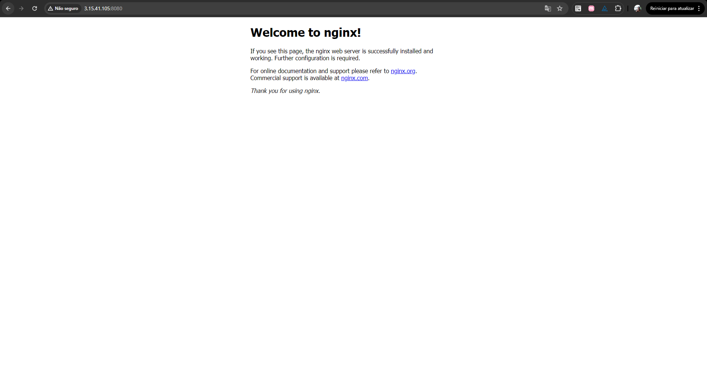

# aws-ec2-docker-nginx
EC2 on AWS running Docker containers with nginx exposed to the internet.
# AWS EC2 + Docker + Nginx

## Overview
This project demonstrates a basic cloud infrastructure using AWS EC2 running Docker containers.

## Architecture
- AWS EC2 (Amazon Linux 2023)
- Security Groups (ports 22, 80, 8080)
- Docker
- Nginx (host + container)

## Steps
1. Created EC2 instance
2. Configured Security Groups
3. Installed Docker 
4. Ran nginx container exposing port 8080

## How to Run
```bash
docker run -d -p 8080:80 nginx
Lessons Learned
Security Groups act as a firewall

Containers require port exposure

Linux services vs containerized services

“For demo purposes, SSH is open to the internet. In production, SSH access should be restricted to specific IPs.”
## Screenshots

### Docker container running


### Accessing the container in the browser


### Security Group inbound rules


## Result
The nginx container is running and exposed via port 8080 on an AWS EC2 instance.

Access: http://3.15.41.105:8080
